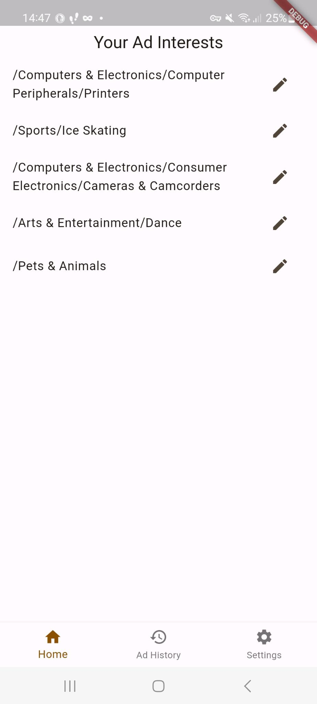
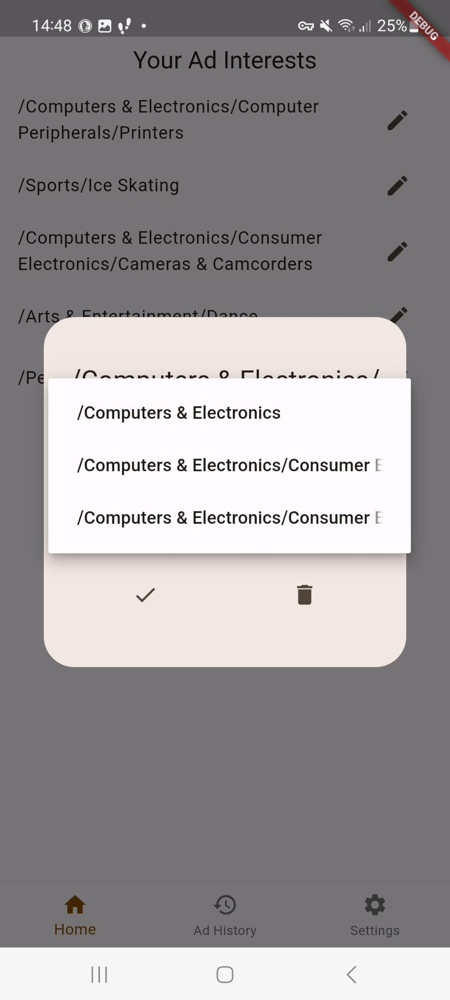
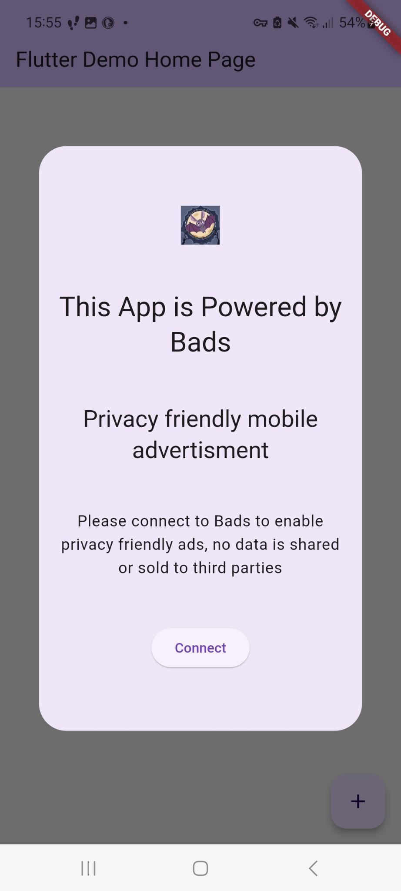
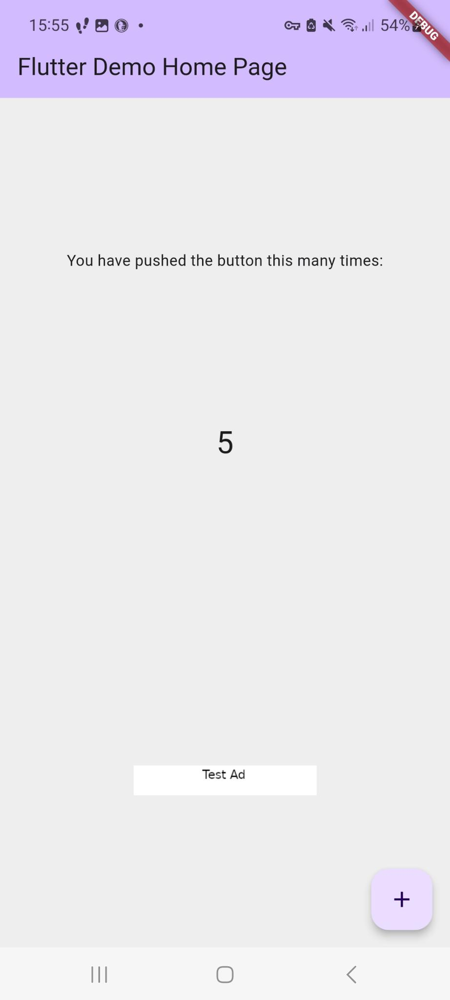
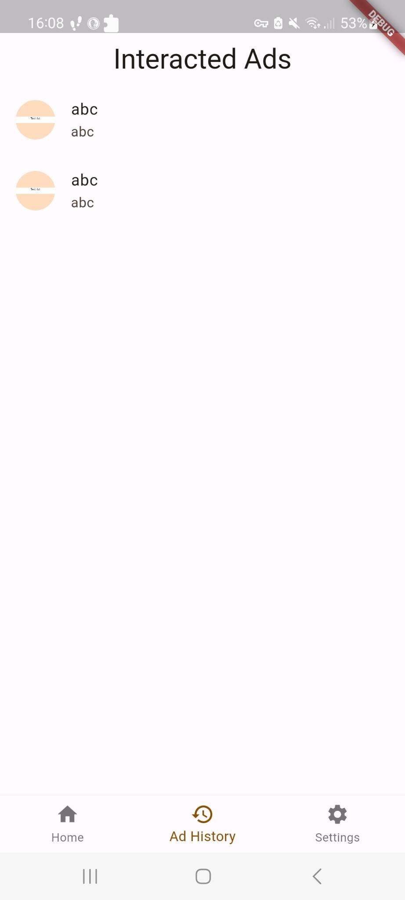

# app

App for the bads project, allows users to controll their ad topics settings.

## Run it

**Required**:
- Flutter SDK
- Android Studio
- Backend up and running
- SDK Demo app installed

Please search and replace for all: `http://*` occurances, and replace it with your ip and port.
And go:
- Run: `flutter run`

## Time complexity:
- Create ad profiles: `AdProfileJob.dart` ll. 42-73 , `BloomProfileCreator` ll. 19-40, `BloomFilter.dart` ll. 33-39
- Storing ad interactions: `RequestInteractedAdsJob.dart` ll. 25-53, `IDService.dart` ll. 66-82, `DBSingleton.dart` ll. 79-87

## Getting Started

This project is a starting point for a Flutter application.

A few resources to get you started if this is your first Flutter project:

- [Lab: Write your first Flutter app](https://docs.flutter.dev/get-started/codelab)
- [Cookbook: Useful Flutter samples](https://docs.flutter.dev/cookbook)

For help getting started with Flutter development, view the
[online documentation](https://docs.flutter.dev/), which offers tutorials,
samples, guidance on mobile development, and a full API reference.

TODO: workmanger ios perform last setup: SystemCapabilities